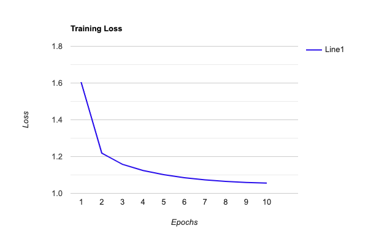

# Results

To reiterate the objectives for this project, my goal was to generate fake reviews based on Amazon product review data, classify them as either positive or negative and assign an overall rating, then predict whether or not the generated reviews would be considered "helpful". I produced 10 reviews using the GRU Keras model which I trained on the "Kindle Store" subset of the Amazon data [4] with 10 epochs. Below is one of the reviews generated. 

*"The books were going to caught up it with a strong holiday wester series. There are some grammar and twists. I loved this book, but it had moments of bad dialogue. It was miss the story that leaves you hanging right into the story as I started reading the book in the series. I was hooked from judgeous woman of angst and ways outside of that. Which I endone who play!! loved every world they keep getting better. The author made the short story to buy a novella that says it and end, but that's of preparing to come. I don't know if it, I'm looking forward to more of her two paranormal errors, and be read. Oh my god.  Linded hard no matter what to do so. The Saga is a pretty good guy and 4 to help pull other if she wants... the reader safe the sense of being sweet, and she is starting to reach them everything. While it was still going against meetamining onlones and act-as she story putting them out of cohe into a first practical ending. Surpers camp to the couple that, turns, and stay kidnapped an"*

As you can see, the reviews had a few spelling mistakes and although the words were english, the sentences did not make much sense. I believe that if trained on more epochs or a larger dataset, the results would be significantly better. Also, since the dataset consisted of reviews written by humans, there is no gauarantee that words were spelled correctly and proper grammar was used. A graph showing the training loss is shown below. Evaluating a text generation model is tricky and the easiest way is by human judgement. The generated reviews are not ideal and need to be improved on order to appear real. I believe it is a good start and future projects could include refining the model and dataset to obtain better results. 

 

Next, I used the 10 reviews generated by the model as input for the text classification model. The results are shown below and the full reviews are at the end of this page with the corresponding number. 4 were classified as positive and 6 as negative. The model had an accuracy of 0.638 which is not satisfactory. I believe that making the generated reviews shorter would improve the results as there would be less opportunity for a mix of positive and negative words to be generated and confuse the classification model. I gave each review an overall rating based on the  

1. positive
2. positive
3. negative
4. negative
5. negative
6. positive
7. negative
8. negative
9. negative
10. positive

| 1. positive | 2. positive | 3. negative | 3. negative | 3. negative |
|---|---|---|---|---|
|  6. positive | 3. negative | 3. negative | 3. negative | 10. positive |

### [Back to Main Page](index.md)
