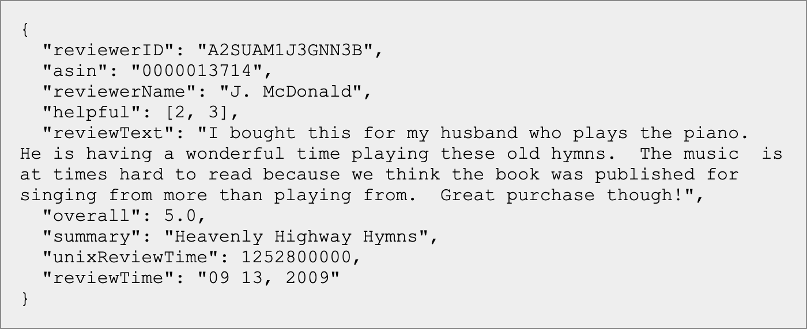

# Explanation of the Models

## Dataset
For this project, I have chosen to use a dataset of Amazon product reviews by Julian McAuley of UCSD [4]. I decided to use the "Kindle Store" subset due to its size and my computers conputational power. Each entry in this dataset represents a review. Below is an example of a review and its fields. The fields I will focus on are "helpful", "reviewText", and "overall".

 

Notice the "helpful" field is a tuple of two integers. The first being the number of upvotes on a review and the latter being the total number of votes on a review. This is important for the helpfulness classification model.

## Text Generation
I used the Tensorflow RNN text generation tutorial [6] as a basis for this model. First, I downloaded the text file that I preprocessed for the classification model. Then, I vectorized the text, meaning converted them from text data to numerical representations. This RNN model is character-based, so given a chracter it will predict the next probable character. To create the training and testing sets, I created sequences of text with a length of 100. These are the input sequences and the corresponding target is a sequence of the same length shifted over one character to the right. 

## Text Classification

## Helpfulness Classification

### [Results & Conclusion](conclusion.md)

### [Back to Main Page](index.md)
