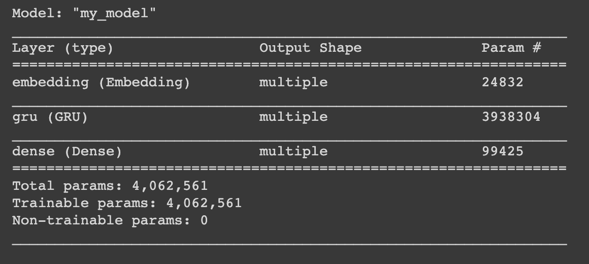

# Explanation of the Models

## Dataset
For this project, I have chosen to use a dataset of Amazon product reviews by Julian McAuley of UCSD [4]. I decided to use the "Kindle Store" subset due to its size and my computers conputational power. Each entry in this dataset represents a review. Below is an example of a review and its fields. The fields I will focus on are "helpful", "reviewText", and "overall".

 

Notice the "helpful" field is a tuple of two integers. The first being the number of upvotes on a review and the latter being the total number of votes on a review. This is important for the helpfulness classification model.

## Text Generation
I used the Tensorflow RNN text generation tutorial [6] as a basis for this model. First, I downloaded the text file that I preprocessed for the classification model. Then, I vectorized the text, meaning converted them from text data to numerical representations. This RNN model is character-based, so given a chracter it will predict the next probable character. To create the training and testing sets, I created sequences of text with a length of 100. These are the input sequences and the corresponding target is a sequence of the same length shifted over one character to the right. Next, I created trainig batches with the shuffled data to feed into the model. The actual model is a Keras model with a GRU layer. GRU stands for "Gated Recurrant Unit" and I chose this over an LSTM model because it is simpler to use and faster on smaller training sets. Below is the model summary.

 

I attached an optimizer and loss function to the model and configured checkpoints before training the model on the data. I used 10 epochs as that was what my computer was capable of. After training the model, I generated the reviews by running the model through a loop and saved them to a text file.

## Text Classification
I used NLTK's Naive Bayes classifier for this model because it seemed to be the prefered model for text classification. The purpose is to classify a review as either positive or negative. First, I downloaded the data from online and converted it to a dataframe. Then, I removed all reviews with no text and those with 3 stars since those are neother positive or negative. I also removed all unnecessary columns which left just the overall rating and the review text. Once I filtered the reviews, I saved them to a text file for use in the text generation model. Next, I created positive (>3 stars) and negative (<3 stars) review lists of equal lengths. I cleaned the lists by making them all lowercase and removing stopwords and punctuation. Then, I made lists of positive and negative words to become feature sets for the model. I combined the feature sets and split them into training and testing sets and trained the model. 

## Helpfulness Classification
I tested various supervised learning models from sklearn to see which was the most accurate in order to predict whether or not a review is helpful. I started by downloading the data and converting it to a dataframe. I then removed unnecessary columns and split the "helpful" column into the numerator and denominator. I also got rid of reviews that had less than 10 votes as they do not have enough user input to be classified as helpful or not. I created a new "Helpfulness" column that contained a binary value with a 0.5 threshold for the ratio between the numerator and denominator. 0 being not helpful and 1 being helpful. I cleaned the text data and made it all lowercase, removed punctuations, tokenized it, removed word stems, vectorized it, and created a feature set. Then, I split the data into training and testing sets to evaluate model performance. 

### [Results & Conclusion](conclusion.md)

### [Back to Main Page](index.md)
